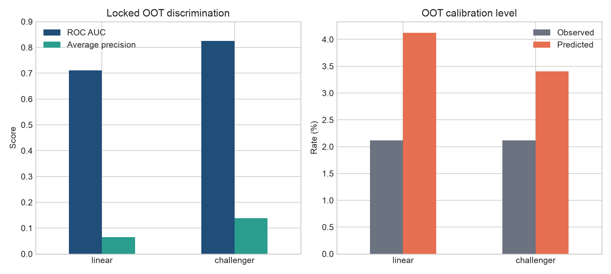
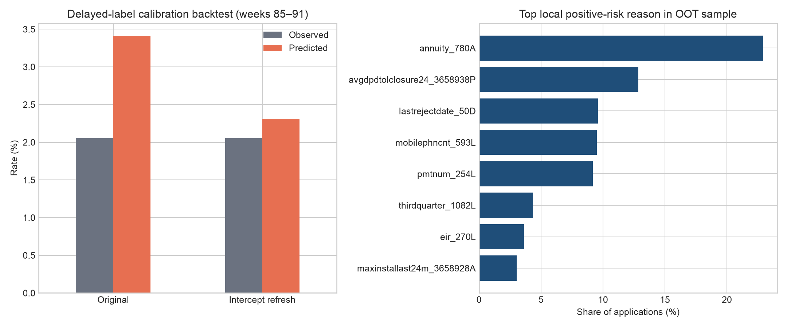

# Credit Risk Decision Lab

An end-to-end credit-risk case study built around the **Home Credit — Credit Risk
Model Stability (2024)** data. The project asks a harder question than “which model
has the best AUC?”:

> Can a lender rank and calibrate application risk, preserve performance as the
> applicant population changes, and turn the score into a controlled underwriting
> policy with honest economic and regulatory boundaries?

**[Open the interactive decision dashboard](https://thvh2006.github.io/credit-risk-decision-lab/)** ·
[Model card](docs/model_card.md) ·
[Executive decision memo](docs/executive_decision_memo.md) ·
[Reproduce the analysis](#reproduce)

## Executive snapshot

| Scale | Locked OOT performance | Calibration action | Recommended decision |
|---|---|---|---|
| **1.53M** applications across 92 weeks | **0.8253 AUC**, **0.6507 Gini** | ECE reduced **80.1%** with a delayed-label intercept refresh | Advance to **shadow mode**, not automated decline |

The challenger preserves risk ordering in future cohorts, but its absolute PD level
does not travel unchanged across prevalence regimes. The project therefore separates
four questions that are often collapsed into one: ranking, calibration, underwriting
policy, and production monitoring.



The [interactive dashboard](https://thvh2006.github.io/credit-risk-decision-lab/)
lets reviewers move the approval target and LGD assumption, then see the frozen OOT
cut-off, realised approval rate, bad rate, exposure proxy, and scenario loss.



## What this demonstrates

- leakage-safe relational feature engineering at application time;
- chronological development, calibration, policy, and locked out-of-time cohorts;
- an interpretable logistic baseline and an XGBoost challenger;
- discrimination, calibration, time stability, and drift diagnostics;
- approval/manual-review/decline policy simulation with explicit LGD assumptions;
- delayed-label intercept recalibration and aggregate local reason-code evidence;
- model-risk controls, adverse-action design, fairness measurement boundaries, and
  monitoring triggers.

The source target is **not** presented as a Basel or IFRS 9 probability of default:
its contractual horizon and default definition are not publicly specified. Raw data
is never committed because it is governed by Kaggle competition terms.

Repository code and original documentation are MIT licensed. Home Credit source data
is excluded and remains governed by the competition terms.

## Decision flow

```text
application-time data
        │
        ▼
eligibility + leakage controls ──► data-quality/manual-review flags
        │
        ▼
chronological feature pipeline
        │
        ├──► logistic baseline
        └──► XGBoost challenger
                  │
                  ▼
        untouched calibration window
                  │
                  ▼
  policy thresholds chosen on later weeks
                  │
                  ▼
 locked OOT evaluation + monitoring design
```

## Repository map

| Path | Purpose |
|---|---|
| `src/metrics.py` | Gini stability, calibration, PSI, and policy metrics |
| `src/temporal.py` | deterministic chronological cohort assignment |
| `src/data_contract.py` | schema, label, key, chronology, and leakage checks |
| `src/monitoring.py` | weekly performance and trigger evaluation |
| `configs/project.yaml` | reproducible target, split, and policy assumptions |
| `reports/` | reproducible metrics, policy tables, feature inventory, and figures |
| `dashboard/` | interactive visual case study and policy simulator |
| `docs/` | research, data profile, model card, decision memo, and controls |
| `tests/` | executable checks for metric and split behaviour |

## Reproduce

```bash
python -m venv .venv
source .venv/bin/activate
pip install -e '.[dev]'
pytest
ruff check .
```

On macOS, XGBoost also needs the OpenMP runtime (`brew install libomp`). No raw
competition file is distributed by this repository.

After joining the Kaggle competition, place source files under `data/raw/`. That
directory, prepared data, and fitted artefacts are ignored by Git. The first data
milestone uses `train_base.parquet` to prove the temporal evaluation harness before
adding depth-0/1 relational history.

## Headline locked-OOT result

The depth-0 XGBoost challenger reaches **0.8253 ROC AUC**, **0.6507 Gini**, and
**0.1384 average precision** on 151,707 locked OOT applications. The corresponding
linear baseline reaches 0.7113 AUC. Ranking remains strong, while absolute calibration
drifts: mean predicted PD is 3.41% versus a 2.12% observed target rate. This is the
project's central model-risk finding, not a number hidden by random splitting.

Read the [model card](docs/model_card.md), [data profile](docs/data_profile.md), and
[executive decision memo](docs/executive_decision_memo.md) before interpreting the
score or policy simulation.

## Evidence standard

Headline results will only be added after the pipeline runs on the real source data.
Until then, no model score, approval uplift, or business impact is claimed. Every
reported result must identify its cohort, sample size, target rate, model version,
calibration method, and whether a parameter is observed or assumed.

## Current status

- [x] dataset and claim-boundary decision
- [x] model development charter and leakage policy
- [x] official stability metric implementation
- [x] probability, calibration, PSI, and approval-policy metrics
- [x] deterministic chronological split contract
- [x] monitoring triggers and tests
- [x] source-data profile and checksummed feature inventory
- [x] logistic and XGBoost OOT benchmark
- [x] calibration, policy, OOT transfer, and LGD sensitivity reports
- [x] model card and executive decision memo
- [x] privacy-safe local reason-code prototype and rolling recalibration backtest
- [ ] protected-group audit (requires validated and lawful audit attributes)

See [the model development charter](docs/model_development_charter.md) for the
intended use and [the research synthesis](docs/research_synthesis.md) for how each
external source changes implementation.
