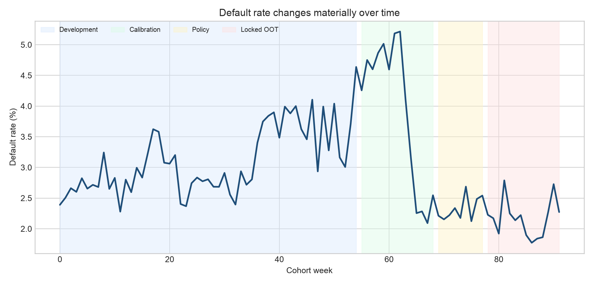

# Real-data profile and temporal diagnosis

## Scope and provenance

This analysis uses the Home Credit — Credit Risk Model Stability competition data
after accepting its rules. Raw files remain local and are not redistributed. The
first benchmark deliberately limits itself to application-level (`depth=0`) data:

| Source | Rows | Predictor columns | Role |
|---|---:|---:|---|
| `train_base.parquet` | 1,526,659 | 5 control/label fields | key, decision date, cohort, target |
| `train_static_0_0/1.parquet` | 1,526,659 | 167 | internal application/history summaries |
| `train_static_cb_0.parquet` | 1,500,476 | 52 | external credit-bureau summaries |

Both static sources are one row per `case_id`; 26,183 base cases have no external
depth-0 record. Left joins preserve all 1,526,659 applications and introduce no key
duplication.

## Outcome and chronology

- 47,994 observed defaults; overall target rate **3.1437%**.
- 92 weekly cohorts, `WEEK_NUM` 0–91.
- Decision dates span **2019-01-01 to 2020-10-05**.
- Weekly applications range from 825 to 35,920.
- Weekly default rates range from 1.7722% to 5.2144%.

## Locked temporal design

| Partition | Weeks | Rows | Defaults | Default rate | Purpose |
|---|---:|---:|---:|---:|---|
| Development | 0–54 | 1,129,770 | 35,310 | 3.1254% | feature policy and model fitting |
| Calibration | 55–68 | 171,375 | 7,735 | 4.5135% | probability calibration only |
| Policy | 69–77 | 73,807 | 1,734 | 2.3494% | threshold selection only |
| Locked OOT | 78–91 | 151,707 | 3,215 | 2.1192% | final evaluation only |

Within development, weeks 0–47 provide the model fit sample and weeks 48–54 drive
early stopping. This prevents tuning against calibration, policy, or OOT outcomes.

## Central diagnosis

The OOT target rate is **32.2% lower** than development and **53.1% lower** than
calibration. Mean weekly application volume is also **47.2% lower** than development.
A random split would hide this cohort change, but the public fields cannot distinguish
population drift from right-censoring: no outcome-window end date or per-row
label-maturity timestamp is provided. Chronological validation therefore reveals
three different questions:

1. Does the model preserve risk ordering as the population changes?
2. Does a fitted probability still represent the new cohort's absolute event rate?
3. Are late labels mature enough for either answer to be interpreted operationally?

The benchmark answers “largely yes” to the first, “not without controls” to the
second, and “not identifiable from this release” to the third. See
`reports/label_maturity_diagnostic.json`.

## Feature controls

- Absolute predictor dates are replaced by days before `date_decision`.
- Cohort, decision date, month, file identity, target, and key are never predictors.
- Eight fields related to birth date, marital status, or education are excluded from
  the main model under the sensitive/proxy-risk policy.
- Eleven predictors exceeding 98% missingness in development are excluded.
- Category frequency mappings are fitted on development only; unseen later values
  map to zero frequency.
- The fitted inventory contains 178 numeric and 19 categorical predictors. Its CSV
  is checksummed so review and training use the same manifest.

The complete evidence is in `reports/feature_inventory.csv` and
`reports/feature_inventory.sha256`.

## Limitations

The public target definition does not disclose a contractual default horizon or a
regulatory definition of default. It is therefore called the **source target**, not
Basel PD or IFRS 9 PD. The first benchmark does not yet aggregate depth-1/2 history;
that is a documented extension, not evidence silently omitted from the result.
