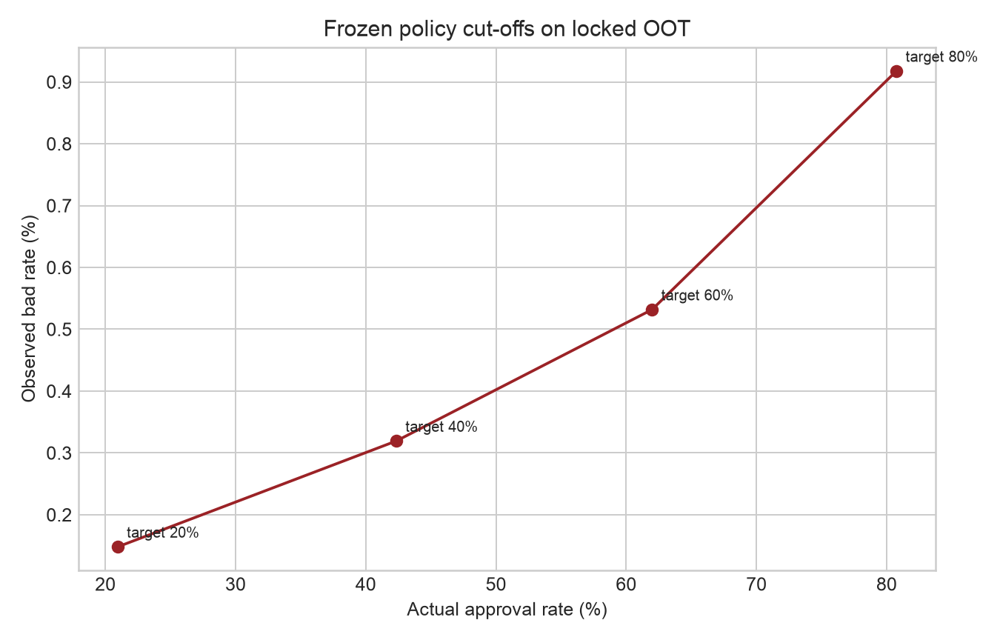

# Executive decision memo

## Recommendation

Advance the depth-0 challenger to a **shadow-mode validation**, not live automated
decline. It demonstrates strong later-cohort ranking and stable policy cut-offs, but
its absolute probability level is not transportable without recalibration controls.

## What the evidence supports

The locked OOT AUC is 0.8253 versus 0.7870 for the stronger quantile-binned logistic
baseline (and 0.7113 for the raw linear baseline). The model is therefore better at
ordering risk in future cohorts without relying on an inflated weak-baseline gap. Cut-offs selected on
the earlier policy window also transfer without dramatic approval-volume drift:

| Policy target | Frozen PD cut-off | OOT approval | OOT approved bad rate | OOT approved cases |
|---:|---:|---:|---:|---:|
| 20% | 0.754% | 20.94% | 0.148% | 31,760 |
| 40% | 1.567% | 42.33% | 0.319% | 64,222 |
| 60% | 2.574% | 61.98% | 0.532% | 94,027 |
| 80% | 4.820% | 80.75% | 0.918% | 122,497 |

The score-distribution PSI between policy and OOT is 0.0028, which is low. Approval
rates slightly exceed their policy targets because the later population shifts toward
lower scores. This is preferable to a capacity shock but still requires limits.

## What the evidence does not support

The model's OOT mean predicted PD is 3.41% while the observed target rate is 2.12%.
Late weekly volume also falls, and label maturity cannot be ruled out because the
release lacks an outcome-window end date. The gap must not be labelled pure drift.
The ranking is useful; the numeric PD should not be fed directly into pricing,
capital, or expected-loss reporting. The source also lacks validated recovery,
realised EAD, funding cost, margin, and default-horizon fields. Monetary figures in
the sensitivity table are scenario arithmetic using credit amount as an exposure
proxy and LGD assumptions of 25%, 45%, and 65%—not a business-case forecast.

## Proposed shadow-mode gates

1. Reproduce the score from a versioned feature view and retain decision-time input
   snapshots.
2. Monitor approval rate, score PSI, missingness, provider coverage, weekly Gini,
   observed rate, and calibration intercept by cohort.
3. Trigger investigation at PSI 0.10 or AUC decline 0.03; treat PSI 0.25 or AUC
   decline 0.05 as a breach. Calibration-gap thresholds require label-maturity rules.
4. Validate customer-level reason codes against model behaviour; global importance is
   insufficient.
5. Complete protected-group and proxy audits with legally approved audit attributes.
6. Compare shadow decisions with policy overrides, reviewer capacity, and historical
   selection effects before any limit expansion.

## Decision reversal conditions

Do not advance if ranking degrades outside tolerance, calibration cannot be restored
without frequent OOT refits, external-data missingness becomes policy-dependent,
reason codes are unstable, group harms cannot be mitigated, or reject-inference tests
show that the apparent approval frontier relies on historical selection bias.
